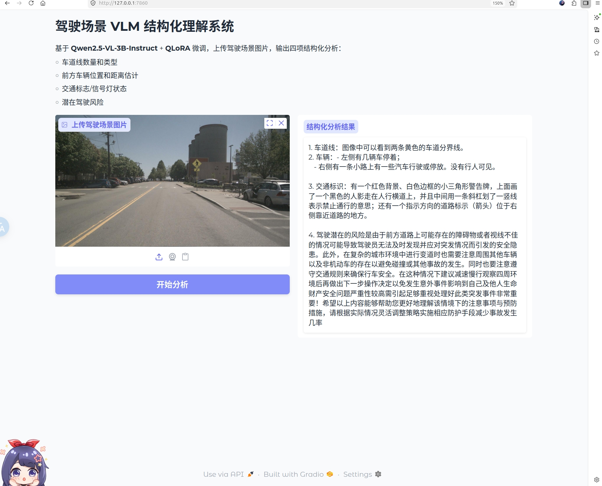
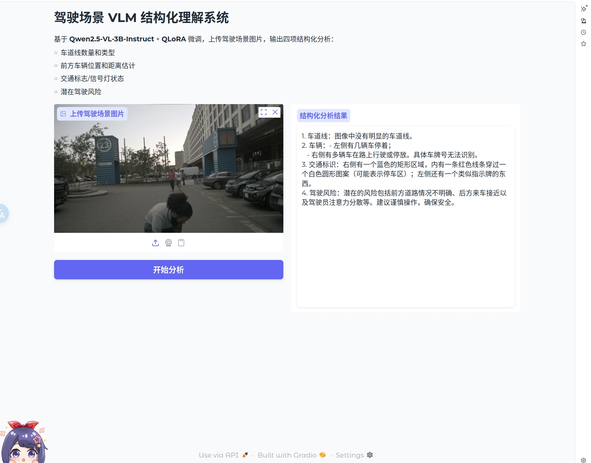
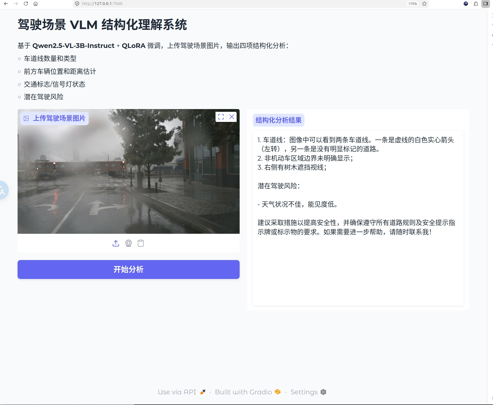
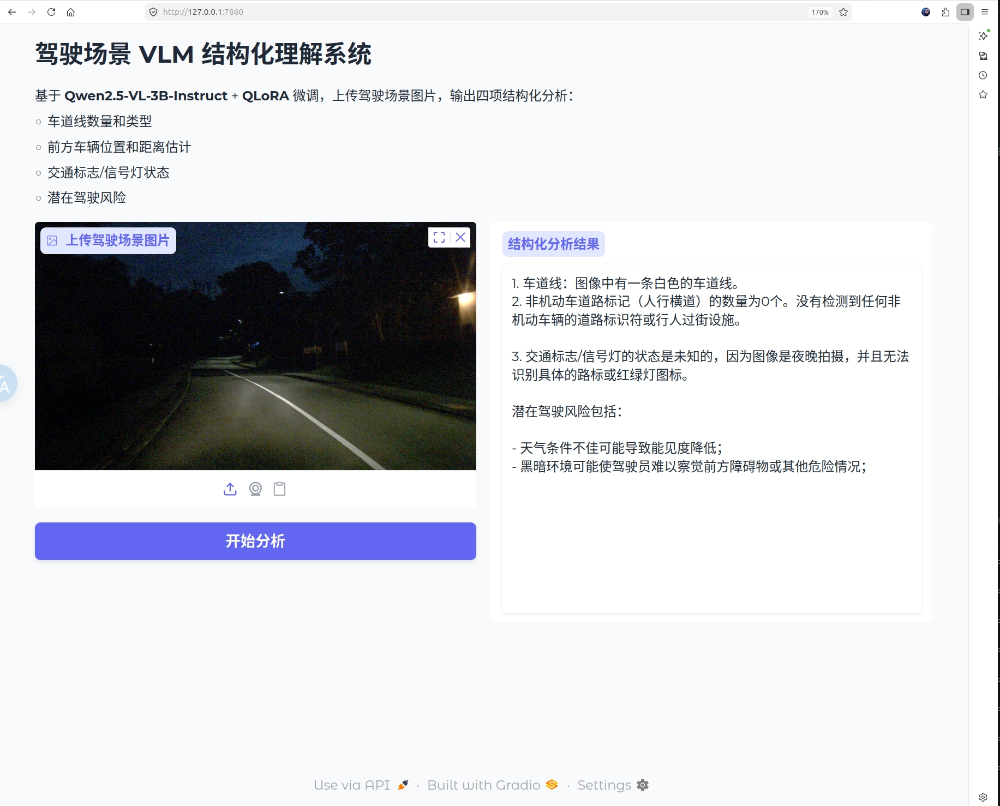
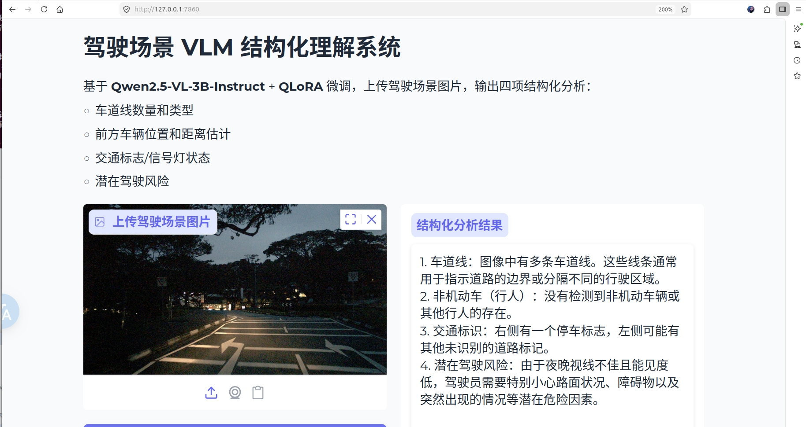

# 基于VLM的智能驾驶场景结构化理解系统

基于 **Qwen2.5-VL-3B-Instruct** + **QLoRA** 微调的驾驶场景结构化理解项目。输入一张驾驶场景图片，模型输出四项结构化分析：车道线、车辆、交通标志、驾驶风险。

## Demo 效果展示

<table>
  <tr>
    <td align="center"><b>城市道路停车</b></td>
    <td align="center"><b>路口场景</b></td>
    <td align="center"><b>雨天道路</b></td>
  </tr>
  <tr>
    <td></td>
    <td></td>
    <td></td>
  </tr>
</table>

<table>
  <tr>
    <td align="center"><b>夜间道路 1</b></td>
    <td align="center"><b>夜间道路 2</b></td>
  </tr>
  <tr>
    <td></td>
    <td></td>
  </tr>
</table>

## 技术栈

| 类别 | 技术 |
|------|------|
| 基座模型 | Qwen2.5-VL-3B-Instruct (7.1GB) |
| 微调方法 | QLoRA (4-bit NF4 + LoRA r=8) |
| 训练框架 | transformers + peft + trl |
| 量化配置 | BitsAndBytesConfig (bfloat16 + NF4) |
| 数据集 | nuScenes CAM_FRONT (500张训练 + 50张评估) |
| Web Demo | Gradio |
| Python | 3.10 |
| PyTorch | 2.6.0 + CUDA 12.6 |

## 环境安装

创建 conda 环境：

```bash
conda create -n vlm_drive python=3.10 -y
```

激活环境：

```bash
conda activate vlm_drive
```

安装 PyTorch（CUDA 12.6）：

```bash
pip install torch==2.6.0 torchvision==0.21.0 --index-url https://download.pytorch.org/whl/cu126
```

安装项目依赖：

```bash
pip install -r requirements.txt -i https://pypi.tuna.tsinghua.edu.cn/simple --trusted-host pypi.tuna.tsinghua.edu.cn
```

## 下载模型权重

安装 modelscope：

```bash
pip install modelscope
```

下载 Qwen2.5-VL-3B-Instruct 到本地：

```bash
modelscope download Qwen/Qwen2.5-VL-3B-Instruct --local_dir models/Qwen2.5-VL-3B-Instruct
```

## 数据准备

本项目使用 [nuScenes](https://www.nuscenes.org/nuscenes) 自动驾驶数据集，需前往官网注册下载。

生成训练数据（nuScenes 标注 → VLM 对话格式）：

```bash
python scripts/04_prepare_training_data.py
```

准备评估数据（从候选图中筛选 50 张）：

```bash
python scripts/02_prepare_eval_data.py
```

## 训练

本项目在云端 GPU（恒源云 RTX 3090 24GB）上完成 QLoRA 微调，训练约 36 分钟。

启动训练：

```bash
python scripts/05_lora_train_cloud.py
```

训练完成后 LoRA 权重保存在 `models/lora_round3/`

训练配置：

| 参数 | 值 |
|------|-----|
| LoRA rank | 8 |
| LoRA alpha | 16 |
| 目标模块 | q_proj, v_proj |
| 训练轮数 | 3 epochs |
| 学习率 | 2e-4 |
| 梯度累积 | 8 steps |
| 量化 | 4-bit NF4 + bfloat16 |

## 推理

### Gradio Web Demo

启动 Demo：

```bash
python scripts/08_gradio_demo.py
```

浏览器打开 http://127.0.0.1:7860

### Python API 调用

单张图片推理：

```python
from scripts.07_inference_api import DrivingSceneAnalyzer
from PIL import Image

analyzer = DrivingSceneAnalyzer(
    model_path="models/Qwen2.5-VL-3B-Instruct",
    lora_path="models/lora_round3"
)

image = Image.open("demo_images/demo_城市道路停车.jpg")
result = analyzer.analyze(image)
print(result)
```

批量推理：

```python
results = analyzer.analyze_batch("data/eval_images/", output_file="results.json")
```

## 项目结构

```
├── scripts/
│   ├── 01_inference.py              # 单张图片推理
│   ├── 02_prepare_eval_data.py      # 评估数据准备
│   ├── 03_eval_inference.py         # Baseline 批量推理
│   ├── 04_prepare_training_data.py  # 训练数据生成（nuScenes → VLM 对话格式）
│   ├── 05_lora_train_cloud.py       # 云端 QLoRA 训练
│   ├── 06_lora_eval.py              # LoRA 模型评估推理
│   ├── 07_inference_api.py          # 推理模块封装（DrivingSceneAnalyzer 类）
│   └── 08_gradio_demo.py            # Gradio Web Demo
├── demo_images/                     # Demo 效果图（5张精选）
├── docs/
│   └── 问题总结/                    # 核心踩坑记录
├── requirements.txt                 # Python 依赖
└── README.md
```

## License

MIT
